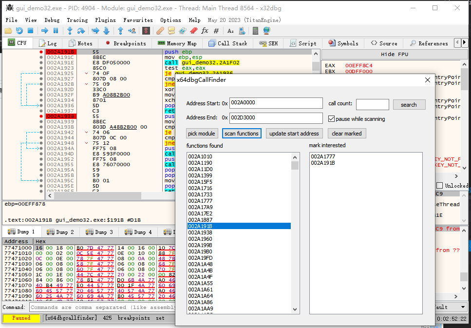

# x64dbgCallFinder

A x64dbg plugin for quickly locating key functions.

English / [简体中文](./README_CN.md)

## Install

Copy the plugin to the x64dbgroot\release\\\<x32|x64>\plugins\ directory.

## Usage

### Step 1: Run the program

Press F9 to run the program.

### Step 2: Function scanning

This step will search for user functions and set conditional breakpoints. If the number of functions is large (for example, greater than 100), the x64dbg window may be blocked for tens of seconds.

### Step 3: Trigger the software function

For example, if you want to find the click event of a certain button (assuming the function is onClick), just click this button. At this point the call count of onClick is incremented by 1.

### Step 4: Filter according to the number of calls

Enter the new number of calls in the text box, since the button is clicked once, the number of calls is 1. Click the search button, and the address of the function that meets the criteria will be printed in the text box and log window.

### Step 5: Repeat the above steps

Click the button again, then enter 2 in the text box, and then click the search button, and the number of filtered results will be reduced.

Repeat the above steps until you find the onClick function.

## How it work

Search all user functions, and set a conditional breakpoint, the number of function calls will be recorded. Filter functions of interest based on call count.

## TODO

- Too many breakpoints cause the debugger to freeze

## See also

cheat engine code filter:

https://www.youtube.com/watch?v=csrU18C4rWY

## License

x64dbgCallFinder is licensed under the MIT License.
