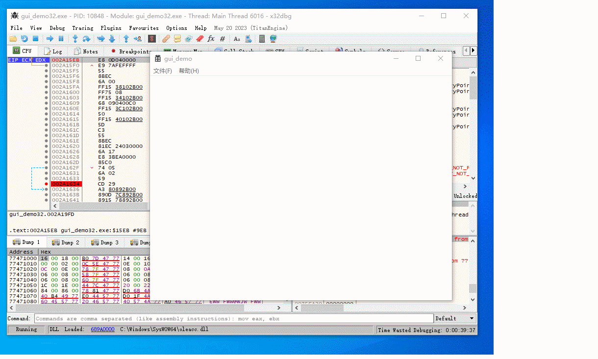

# x64dbgCallFinder

通过条件断点高效地定位关键函数，用法和Cheat Engine非常类似。

## 安装

将插件拷贝到 x64dbgroot\release\\\<x32|x64>\plugins\ 目录

## 使用方法

使用方式和cheat engine搜索数据非常类似。

### 第一步：运行程序

按F9让程序运行起来。

### 第二步：函数扫描

这一步会搜索用户函数并设置条件断点，如果函数数量较多（例如大于100），则可能会阻塞x64dbg窗口数十秒。

### 第三步：触发软件功能

例如想找某个按钮的点击事件（假设函数是onClick），就点击一下这个按钮。此时 onClick的调用计数增加1。

### 第四步：根据调用次数过滤

在文本框输入新的调用次数，由于点击了一次按钮，调用次数是1。点击 search 按钮，符合条件的函数地址将会在文本框和日志窗口打印。

### 第五步：重复上述步骤

再次点击按钮，然后在文本框输入2，然后点击 search 按钮，此时筛选结果数量会变少。

重复上述步骤，直到找到onClick函数。

## 原理

搜索所有用户函数，并设置条件断点，函数调用次数将被记录。根据调用次数筛选感兴趣的函数。

## TODO

- 也许在call指令上下断更好？否则 call rax 这样的指令会识别失败

## 开源协议

x64dbgCallFinder is licensed under the MIT License.
